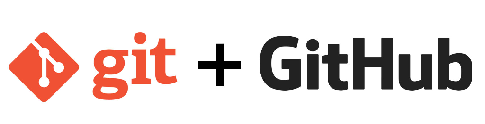

# Git et Github : apprendre le workflow

**Git** est ce qu’on appelle un outil de gestion de versions (Version Control Software en anglais). D'après Wikipédia :

« Un logiciel de gestion de versions agit sur une arborescence de fichiers afin de conserver toutes les versions des fichiers, ainsi que les différences entre les fichiers. »

## En quelques mots :
  * En très très gros, Git est un arbre où chaque modif du fichier correspond à une branche (il faut surtout visualiser les "noeuds" de chaque branche).
  * La "tête" de l'arbre correspond à la dernière version du fichier.
  * On peut travailler en collaboratif sur Git grâce à la plateforme colaborative Github.
  * C'est surtout ça l'intérêt d'ailleurs.
  * Chaque contributeur souhaitant modifier le fichier le fera donc dans une branche propre : d'abord sur son ordi (sur son dépôt local) puis en l'envoyant au propriétaire du fichier initial (le dépôt distant).
  * Après validation de la modif, chaque branche est fusionnée et devient alors la "tête", la dernière version du fichier (au moment t).
  * Le contributeur est content.
  * Les autres contributeurs font de même et ainsi de suite.
  * Le gros avantage de Git est donc que les dev peuvent travailler sur le même programme en même temps sans créer de bug. Et de plus on a un historique complet de chaque modif donc on peut donc revenir en arrière à tout moment.
  * Vous apprendrez ici à récupérer le dépôt distant (en le "clonant" sur votre machine) puis à l'envoyer après modifs sur le dépôt local (en le "pushant" en ligne).

  : )

## Un petit lexique :
* **Dépôt** (ou repo pour repository en anglais) = Un dépôt est un dossier qui porte le nom .git. C'est là que Git va stocker toutes les informations en rapport avec votre projet comme la liste des commits effectués, la liste des branches, etc.
* **Branche** = Une branche peut être vue comme une déviation de votre projet. Cela permet par exemple à plusieurs personnes travaillant sur un même projet de développer des fonctionnalités différentes sans que leurs modifications respectives ne créent de conflits. Un même commit peut ainsi faire partie de plusieurs branches s'il est le point de départ de celles-ci.
* **Push** = Push (pousser) est l’opération qui consiste à envoyer le contenu de son dépôt sur un autre dépôt situé généralement sur une machine distante comme un serveur (par exmple sur Github), de façon à pouvoir le récupérer plus tard depuis une autre machine. Cela permet également à plusieurs personnes de posséder une copie des fichiers sur sa machine ainsi que d’une copie en ligne à partir de laquelle chaque membre peut contribuer. Mais cela implique de pouvoir récupérer les modifications des autres pour ne pas les écraser.
* **Pull** (sens inverse de Push)= Pull (tirer) est donc l’opération qui permet de récupérer le contenu d’un dépôt distant dans son dépôt local.

 
## Workflow avec Github
est « un service web d'hébergement et de gestion de développement de logiciels, utilisant le logiciel de gestion de versions Git » (wikipédia). Autrement dit, c'est une interface d'utilisation de Git.
 
Le workflow du développement avec Github peut être décomposé en un certains nombres d'étapes :
* **1ere étape** : FORK  
on créé une copie du repo dans son propre compte github

* **2eme étape** : CLONE  
on clone le repo sur son ordinateur (en local) afin de pouvoir travailler dessus

* **3eme étape** : on ouvre dans son IDE et on édite le fichier

* **4eme étape** : ADD  
on ajoute à l'index le nouveau dossier/fichier

* **5eme étape** : COMMIT  
on créé un commit (un noeud) dans l'arborescence, associé à un message (comme "Update", ou "Added doc.js",...)

* **6eme étape** : PUSH  
on "push" son dépôt local sur un dépôt distant (sur Github)

* **7eme étape** : PULL REQUEST  
on fait une "requête" pour que le propriétaire du dépôt distant "récupère" notre super contenu qu'on a "pushé", c'est à dire qu'il récupère le fichier avec nos modifications (et à terme qu'il l'intègre dans le dépôt principal).

 
## Ressources

NB : Pour utiliser git sur windows, on peut télécharger [Git for windows](https://git-for-windows.github.io/) qui contient à la fois  l'outil Git Bash (qui émule les lignes de commandes linux) et Git GUI (pour faire la même chose sur une interface).

Pour s'entrainer

* [La clef du succès !](https://try.github.io) !! Et c'est validé par Github

Sur les pull-request :
* [Le super cadavre-request](https://github.com/simplonco/cadavre-request) fait par Sara

* Une [vidéo d'intro](https://www.youtube.com/watch?v=V6Zo68uQPqE) assez pro, à voir pour approfondir (après la pratique !)

* [Le github Simplon](https://github.com/simplonco/git-training) propose des exercices

* [Une vidéo d'intro](https://www.youtube.com/watch?v=V6Zo68uQPqE) assez claire

 

Les interfaces & plug-ins (plus "accessible" mais à chaque fois différentes):

* Github desktop pour windows et linux

* Eclipse et Git : [Le tuto officiel sur OC](http://127.0.0.1:54150/help/index.jsp?topic=%2Forg.eclipse.egit.doc%2Fhelp%2FEGit%2FUser_Guide%2FUser-Guide.html)  
Permet de travailler directement dans Eclipse sans passer par les lignes de commande et sans application tierce.

 
Et :

* Doc très (trop?) complète: http://stackoverflow.com/questions/315911/git-for-beginners-the-definitive-practical-guide/2678236#2678236
  * où on trouve notamment :
    * http://www.ndpsoftware.com/git-cheatsheet.html#loc=workspace
    * http://gitimmersion.com/lab_01.html

----
